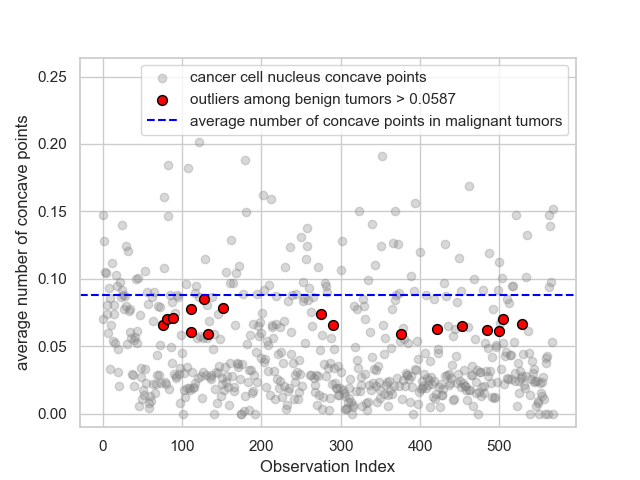
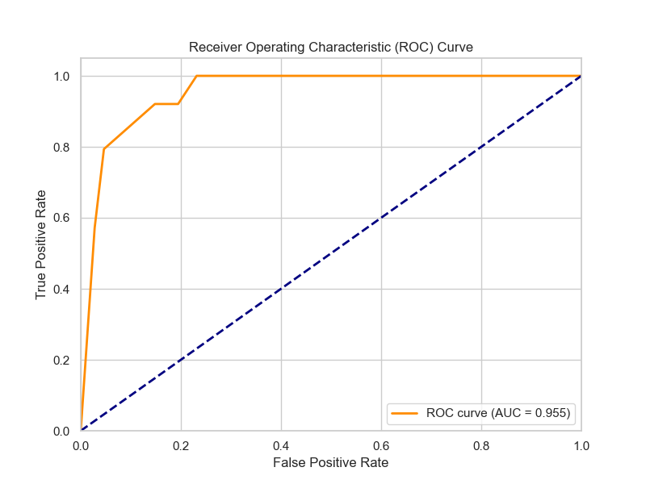

# Breast Cancer Malignancy Prediction using Logistic Regression
## 1. Introduction
This project focuses on developing and evaluating a machine learning model to predict whether a breast mass is benign or malignant, based on characteristics derived from digitized images. Accurate and early diagnosis of breast cancer is crucial for patient treatment and outcomes, and data-driven methods can play a vital role in supporting clinical decisions.

## 2. Data Source
This project utilizes the Wisconsin Breast Cancer Diagnostic (WDBC) dataset, which contains numerical features computed from digitized images of a Fine Needle Aspirate (FNA) of a breast mass. The dataset includes 30 real-valued attributes for each cell nucleus, such as radius, texture, perimeter, area, smoothness, compactness, concavity, concave points, symmetry, and fractal dimension, along with a diagnosis (M = malignant, B = benign).
**Dataset**: [Wisconsin Breast Cancer Diagnostic (WDBC) Dataset](https://www.kaggle.com/datasets/uciml/breast-cancer-wisconsin-data)
**Note:** The dataset file used in this project is named `kreft_dataset.csv` and is located in the `data/` directory.

## 3. Project Goals
The primary objectives of this project were to:

Perform data preparation and feature engineering to transform raw data into suitable predictors for modeling.

Build a logistic regression model for binary classification of breast masses.

Thoroughly evaluate the model's performance on an unseen test dataset.

Understand and interpret the model's predictions, including identifying key predictors and challenges such as quasi-perfect separation.

Reflect on the model's clinical implications based on various performance metrics.

## 4. Methodology
The project followed a standard machine learning workflow, with a strong emphasis on exploratory data analysis and visualization:


**Figure 1:** Correlation Heatmap of Features in the WDBC Dataset.

#### Data Preparation: 
The dataset was loaded and cleaned, handling any missing values or inconsistencies.

#### Exploratory Data Analysis (EDA):
Extensive EDA was performed to understand the distribution of features, identify potential outliers, and explore relationships between variables. Visualizations, including histograms, box plots, scatter plots, and correlation matrices, were used to gain insights into the data's characteristics and identify potential predictors of malignancy.


**Figure 2:** Distribution of cell nucleus extreme 'Concave Points' Benign diagnoses compared to average nucleus concave points of malignant tumors.

#### Feature Engineering: 
Several continuous diagnostic attributes were transformed into binary variables based on clinically relevant thresholds and observed distributions. This transformation proved to be highly effective in distinguishing between the two diagnostic outcomes and simplifying the model.

**Figure 3:** Estimating diagnostic threshold for cell nucleus texture properties.

#### Data Splitting: 
The dataset was split into training and test sets to ensure an objective evaluation of the model's generalization capabilities on unseen data.

#### Model Building:
A logistic regression model was trained on the training data, leveraging its interpretability and efficiency for binary classification.

#### Model Evaluation: 
The model's performance was assessed using a variety of metrics on the test set.

## 5. Model Performance (on test data)
The model was rigorously evaluated on an independent test set to assess its ability to generalize to unseen data.

Confusion Matrix (at default threshold of 0.5):
[[100   7]
 [ 13  51]]
ROC AUC Score: 0.955 (Excellent)
Precision: 0.879 (Very Good)
Sensitivity (Recall): 0.797 (Good)


**Figure 4:** Receiver Operating Characteristic (ROC) Curve for the Logistic Regression Model.

Interpretation of Performance and Clinical Implications:

The model demonstrates excellent overall discriminative power with a high ROC AUC of **0.955**. This confirms its ability to effectively distinguish between malignant and benign diagnoses across various thresholds.

However, the model's current sensitivity of 79.7% for detecting malignant cases is an area requiring further consideration. This means the model unfortunately misses approximately 20% of actual malignant cancer cases (false negatives). Given the severe clinical implications of a missed diagnosis, this is a critical metric to improve.

For a future production model, it would be necessary to investigate methods to increase sensitivity, even if this were to involve some reduction in precision (i.e., an increase in false positives). This could be achieved by adjusting the classification threshold or by exploring other model enhancements. However, for the scope of this portfolio project, such optimization is beyond its current focus.

## 6. Tools and Technologies
Language: Python/ basic SQL
Libraries: pandas, numpy, scikit-learn, matplotlib, seaborn, statsmodels, duckdb
Development Environment: Jupyter Notebook

## 7. How to Run the Project
To get this project up and running on your local machine, follow these steps:

1.  **Clone this GitHub repository:**
    ```bash
    git clone [https://github.com/Sahatfi/Breast-cancer-prediction.git](https://github.com/Sahatfi/Breast-cancer-prediction.git)
    ```

2.  **Navigate to the project directory:**
    ```bash
    cd Breast-cancer-prediction
    ```

3.  **Create and activate the Conda environment:**
    This project uses a Conda environment to manage its dependencies.
    ```bash
    conda env create -f environment.yml
    conda activate breast_cancer_env
    ```

4.  **Open Jupyter Notebook:**
    ```bash
    jupyter notebook
    ```

5.  **Navigate to and open the project notebook:**
    Once Jupyter opens in your browser, find and click on `breast_cancer_prediction.ipynb` to open it.
    
## 8. Future Work
Adjusting the classification threshold to optimize sensitivity based on clinical needs.
Investigate potential quasi-separation.

