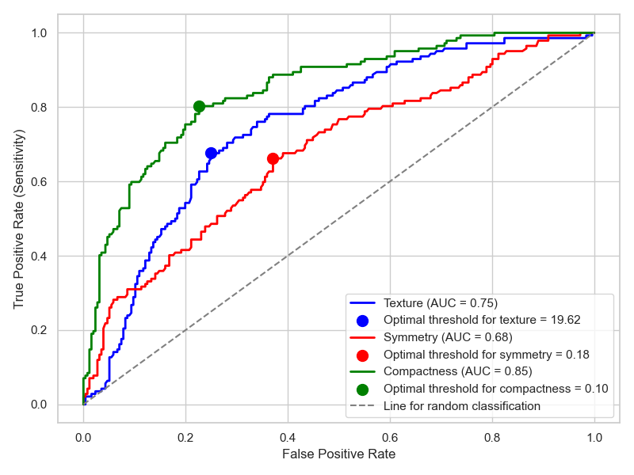

# Brystkreftprediksjon
## 1. Introduction

Dette prosjektet fokuserer på utvikling og evaluering av en maskinlæringsmodell for å predikere om en brystsvulst er godartet eller ondartet, basert på egenskaper utledet fra digitaliserte bilder. Tidlig og korrekt diagnostisering av brystkreft er avgjørende for behandlingsvalg og pasientutfall, og datadrevne metoder kan spille en viktig rolle som beslutningsstøtte i klinisk praksis.

## 2. Datakilde

Prosjektet benytter Wisconsin Breast Cancer Diagnostic (WDBC)-datasettet, som inneholder numeriske variabler beregnet fra digitaliserte bilder av finnålsaspirat (FNA) fra brystsvulster. Datasettet inkluderer 30 kontinuerlige variabler for hver cellekjerne, blant annet radius, tekstur, omkrets, areal, glatthet, kompakthet, konkavitet, konkave punkter, symmetri og fraktal dimensjon, i tillegg til en diagnosevariabel (M = ondartet, B = godartet).
**Datasett**: [Wisconsin Breast Cancer Diagnostic (WDBC) Dataset](https://www.kaggle.com/datasets/uciml/breast-cancer-wisconsin-data)
**Merk:** Datasettfilen som brukes i dette prosjektet heter `kreft_dataset.csv` og er plassert i mappen `data/`.

## 3. Målsetting
Hovedmålene med prosjektet var å:

- Utføre datarensing og feature engineering for å transformere rådata til egnede prediktorer for modellering.

- Bygge en logistisk regresjonsmodell for binær klassifisering av brystsvulster.

- Grundig evaluere modellens ytelse på et uavhengig testdatasett.

- Forstå og tolke modellens prediksjoner, inkludert identifisering av sentrale prediktorer og metodiske utfordringer som kvasi-perfekt separasjon.

- Reflektere over modellens kliniske implikasjoner basert på ulike ytelsesmål.

## 4. Methodikk

Prosjektet fulgte en standard arbeidsflyt innen maskinlæring, med særlig vekt på eksplorativ dataanalyse (EDA) og visualisering:

**Figur 1:** Korrelasjonsvarmekart for variabler i WDBC-datasettet. Variabelnavnene er beholdt på engelsk.


#### Datapreparering: 

Datasettet ble lastet inn og renset, inkludert håndtering av eventuelle manglende verdier og inkonsistenser.

#### Eksplorativ dataanalyse (EDA):

Omfattende EDA ble gjennomført for å undersøke fordelingen av variabler, identifisere potensielle uteliggere og utforske sammenhenger mellom variabler. Visualiseringer som histogrammer, boksplott, spredningsplott og korrelasjonsmatriser ble brukt for å få innsikt i datastrukturen og identifisere potensielle prediktorer for malignitet.


**Figur 2:** Fordeling av ekstreme konkave punkter i cellekjerner ved godartede diagnoser sammenlignet med gjennomsnittlige konkave punkter i ondartede svulster.

#### Feature engineering: 
Flere kontinuerlige diagnostiske variabler ble transformert til binære variabler basert på klinisk relevante terskelverdier og observerte fordelinger. Denne transformasjonen viste seg å være svært effektiv for å skille mellom de to diagnostiske utfallene, samtidig som den økte modellens tolkbarhet.

**Figur 3:** Estimering av diagnostisk terskel for teksturegenskaper i cellekjerner.

#### Datasplitting: 
Datasettet ble delt i trenings- og testsett for å sikre en objektiv vurdering av modellens generaliseringsevne på tidligere usette data.


#### Modellbygging:
En logistisk regresjonsmodell ble trenet på treningsdatasettet, valgt på grunn av sin tolkbarhet og effektivitet for binær klassifisering.

#### Modellevaluering: 
Modellens ytelse ble evaluert ved hjelp av flere ulike ytelsesmål på testdatasettet.

## 5. Modellens ytelse (testdata)
Modellen ble evaluert på et uavhengig testdatasett for å vurdere dens evne til å generalisere til nye observasjoner.

Forvirringsmatrise (terskel = 0,5):
[[100   7]
 [ 13  51]]
ROC AUC: 0,955 (svært god)
Presisjon: 0,879 (meget god)
Sensitivitet (recall): 0,797 (god)


**Figur 4:** ROC-kurve (Receiver Operating Characteristic) for logistisk regresjonsmodell.

## Tolkning av resultater og kliniske implikasjoner

Modellen viser svært god diskriminerende evne, med en høy ROC AUC-verdi på 0,955, noe som indikerer at modellen effektivt kan skille mellom ondartede og godartede diagnoser over et bredt spekter av terskelverdier.

Samtidig er modellens sensitivitet på 79,7 % for identifisering av ondartede tilfeller et viktig forbedringspunkt. Dette innebærer at modellen ikke fanger opp omtrent 20 % av faktiske ondartede tilfeller (falske negative). Gitt de alvorlige kliniske konsekvensene av en uteblitt kreftdiagnose, er dette en kritisk metrikk å adressere.

I en fremtidig klinisk beslutningsstøttemodell vil det være nødvendig å utforske metoder for å øke sensitiviteten, selv om dette kan medføre noe redusert presisjon (flere falske positive). Dette kan for eksempel oppnås ved å justere klassifiseringsterskelen eller ved å videreutvikle modellen. Slike optimaliseringer ligger imidlertid utenfor omfanget av dette porteføljeprosjektet.

## 6. Verktøy og teknologi
Programmeringsspråk: Python, SQL
Biblioteker: pandas, numpy, scikit-learn, matplotlib, seaborn, statsmodels, duckdb
Utviklingsmiljø: Jupyter Notebook

## 7. Hvordan kjøre prosjektet lokalt
For å kjøre prosjektet på egen maskin, følg disse stegene:


1.  **Klon GitHub-repositoriet:**
    ```bash
    git clone [https://github.com/Sahatfi/Breast-cancer-prediction.git](https://github.com/Sahatfi/Breast-cancer-prediction.git)
    ```

2.  **Gå til prosjektmappen:**
    ```bash
    cd Breast-cancer-prediction
    ```

3.  **Opprett og aktiver Conda-miljø:**
    ```bash
    conda env create -f environment.yml
    conda activate breast_cancer_env
    ```

4.  **Åpne prosjekt-notebooken:**
    ```bash
    jupyter notebook
    ```

5.  **Gå til og åpne prosjekt-notebooken:**
    Når Jupyter åpnes i nettleseren, finn og trykk på `breast_cancer_prediction.ipynb` for å åpne notebooken..
    
## 8. Videre arbeid
Justere klassifiseringsterskelen for å optimalisere sensitivitet basert på kliniske behov.
Undersøke forekomst og håndtering av kvasi-separasjon.